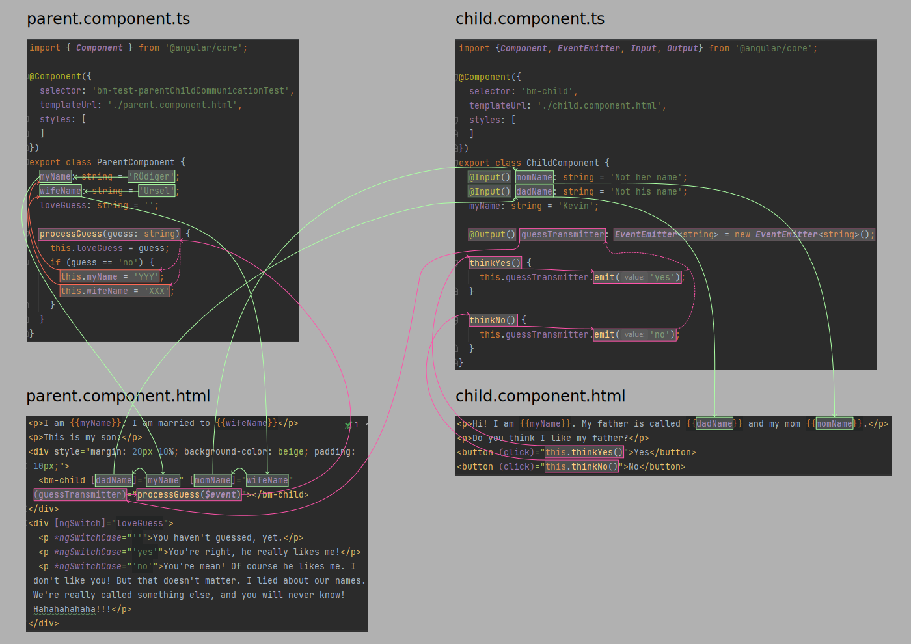
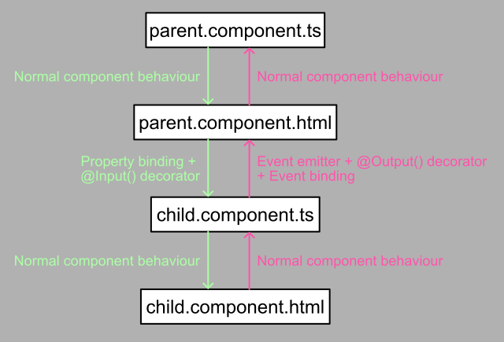

# The Angular Summary 

> If the road is straight, you don't need to do anything. But if an  part comes into  you'd better .

I will structure this document as follows:

1. It'll start with the stuff that is simply most important to get started, like installing packages and creating a
   project.
2. Then I'll make a summary of *angular-cli* commands.
3. This will be followed by *Angular* stuff: How to create components, directives, routing etc. and what needs to be registered, exported and injected where.
4. Lastly, good-to-knows. Stuff that's needed frequently, difficult to understand, or in some way good to know. Likely,
   this will contain quite a few JavaScript and TypeScript basics...


### Syntax

Lets get this straight: `Commands` are generally set with this code formatting. If something is optional, its put into `[brackets]`. Sometimes you have a choice between `this | and | that`. In complicated cases, braces are used for grouping: `command {delete [--force | -f] filename} | {create [txt | docx | md | html]}`. `filenames` and some other `technical specifications` are also formatted like this. I don't know if this conforms exactly to established standards. I don't know if there _are_ established standards. If I learn more about it, I may update this.

Okay, let's get started!

## 1. Getting started

### What you need to have installed

#### Editor

You'll need an Editor like [VS Code](https://code.visualstudio.com/download), better yet an IDE like "Webstorm", but
that's not free...

The following extensions/plugins are recommended (not necessarily up to date):

- Auto Import
- EditorConfig for VS Code
- TSLint
- angular2-inline
- vscode-icons

#### Browser

Obviously, you'll need a browser to run your application in. Since *Angular* is from
Google, [Chrome](https://www.google.com/chrome/) is your best choice, as your chance of finding debugging tools is best
there.

#### Node.js and NPM

Makes JavaScript run outside the browser, even in the backend. It powers various tools that we'll use during development. So you'd better [get it](https://nodejs.org/en/). Check that the installation was successful with `node -v` and `npm -v` in the terminal. *NPM* is a packet manager which lets you install various things that are based on *Node.js*, for example a bunch of things we'll need for *Angular*. A local installation, meaning only for your current project, is done with `npm install <packet name>`. A global install is done with `npm install -g <packet name>`. Very handy is automatic registering of installed packages in your config files, which is achieved by `npm install <packet name> --save` or the angular specific command `ng add <packet name>`.

#### Angular CLI

On Windows it may be necessary to install `npm install -g windows-build-tools`, though this information may be outdated. You'll definitely need to run `npm install -g @angular/cli`.

#### Creating a project and components and what not

To create a new project, simply run

```shell
ng new <project name> [-p <prefix>] [..?]
```

Specifying the `<prefix>` is probably a good idea, though I'm not sure why exactly, yet.

To create a component

```shell
ng generate component <component_name/path>
```

or just

```shell
ng g c <component_name/path>
```

In fact, you can `generate` a [bunch of stuff](https://angular.io/cli/generate), like `app-shell`, `application`, `class`, `component`, `directive`, `enum`, `guard`, `interceptor`, `interface`, `library`, `module`, `pipe`, `resolver`, `service`, `service-worker` and `web-worker`.

#### How to run your application

This point is often forgotten in software documentation or `README`s, because it's so obvious to the developer. But the poor Junior who comes after him is left standing in the rain. So here's how it goes:
```shell
ng serve
```
or (untested by me)
```shell
npm start
```

## Angular specific stuff

### app.module.ts

This is the central module of our application. For lack of better knowledge, I'll say that this is what glues our app together. Let's have a more detailed look at its general structure:

```typescript
/* Our imports. Basically, everything that we'll use later on
in the @NgModule() decorator must be imported here: */
import {BlaBla} from '@angular/blabla';
// import { ... } from '...';
// ... 

/* The @NgModule() decorator takes an object as an argument that 
contains all kinds of meta information about our module, such as */
@NgModule({
    declarations: [
        /* Specify all components, directives and pipes that
           belong to this module. */
    ],
    imports: [
        /* Specify other modules that this one imports */
    ],
    providers: [
        /* This has to do with dependency injection.
           Everything that should be injectable (like 
           services) in this module must be specified here. */
    ],
    bootstrap: [
        /* Specify the root component here.
           You can specify more than one, 
           but that's uncommon. */
    ]
})
export class AppModule {
}
```

### main.ts

This file is concerned with executing the bootstrapping of the application. It typically looks like this:

```typescript
import {enableProdMode} from '@angular/core';
import {platformBrowserDynamic} from '@angular/platform-browser-dynamic';

import {RootModule} from './app/root.module';
import {environment} from './environments/environment';

if (environment.production) {
    enableProdMode();
}

platformBrowserDynamic().bootstrapModule(RootModule);
```

!!! Either add more information or remove this

### index.html

This the HTML file loaded by the browser. It (typically) has a (single) tag in the `<body>` that looks like `<app-root>Loading...</app-root>` and serves as the entry point for *Angular*. This tag is what our application is tied to and will be replaced by the actual content of our page. Other than that, it's a typical HTML file.

### Components

This is the minimal component syntax:

```typescript
import {something} from 'somewhere';

@Component({
    selector: 'my-css-selector',

    // either
    template: `<p>Some HTML, possibly with {{ interpolations }} and</p>
               <span [similar]="stuff">.</span>`,
    // or
    templateUrl: 'path/to/html',

    // either
    style: '.css>selector {as: you know}',
    // or
    styleUrl: 'path/to/css'
    // or nothing
})
export class SomeComponent {
    // the logic of the component
}
```

### Property binding

This is used to assign data to an element's property. That is, to the JavaScript object that belongs to a HTML element. This is distinct from the element's *attributes*, such as `href`. For most *attributes*, there is also a *property*,
that will be assigned the same value. But not always, as in the case of `colspan`! And it's the same the other way around: Not all standard properties have an attribute equivalent, such as `innerHTML`. Now, since DOM objects are just
plane old JavaScript objects, we can add custom properties to them. We just need to know that that by itself need not have any effect! For example, changing an objects `<object>.href` will not change what happens when we click the link! (double check this)

Since that is not confusing enough, there are also a bunch of *different* ways in which we can assign values to properties (or attributes). What you know is

```html

```

which assigns a URL to the `img`'s `src` *attribute*, which will then be assigned to the corresponding JavaScript object's `src` *property*. This is pretty static, but we can replace it with

```html

```

which would be equivalent if you defined the value of `exampleUrl` in your component class:

```typescript
exampleUrl: string = 'http://some/example/image.jpg';
```

The cool thing is that, as soon as the value of the variable `exampleUrl` changes in your class, the `src` property (and its corresponding HTML attribute??) will also be updated without you needing to do anything else!

As long as the value you want to assign to your attribute is only a string, you can also use *interpolation*, as in
```html

```
and you can also assign a fixed string using the property binding syntax
```html

```
however, that's pretty useless, since it will never be updated...

But what if we really want to change an elements *attributes*? Well, if I'm not totally mistaken, that should be possible using the interpolation syntax `colspan={{var}}`, but I'm not sure. What definitely works is

```html

<td [attr.colspan]="var"></td>
```

and it's similar for classes and styles:

```html

<div [class.myClass]="trueOrFalse"></div>
```

which assigns the class `myClass` only if `trueOrFalse==true`.

For styles it goes like

```html

<element [style.color]="myColor"></element>
```

and there is also its own directive:

```html

<div [ngStyle]="{ 'color': myColor, 'padding': '10px' }"></div>
<div [ngStyle]="myStyles"></div>
```

More [info](https://angular.io/guide/property-binding).

### Event binding

[Event binding lets you listen for and respond to user actions such as keystrokes, mouse movements, clicks, and touches.](https://angular.io/guide/event-binding)

Basically, the syntax goes something like

```html

<tag (click)="expression"></tag>
```

which means that if the `<tag>` element is clicked, the `expression` will be evaluated. A typical scenario is

```html

<tag (click)="someFunction($event)"></tag>
```

which passes the`$event` variable to `someFunction()`, which ?(could be / is)? defined in your component's class. This
function then does its magic.

There are standard events you can listen for, but you can also define your own events.

This is a list of standard events, but I don't know if those are all (though
the [source](https://www.positronx.io/useful-list-of-angular-7-event-types-for-event-binding/) says so). This is
surprisingly hard to find...

```typescript
(click) = "some(expression)"
(dblclick) = "some(expression)"

(submit) = "some(expression)"

(blur) = "some(expression)"
(focus) = "some(expression)"

(scroll) = "some(expression)"

(cut) = "some(expression)"
(copy) = "some(expression)"
(paste) = "some(expression)"

(keyup) = "some(expression)"
(keypress) = "some(expression)"
(keydown) = "some(expression)"

(mouseup) = "some(expression)"
(mousedown) = "some(expression)"
(mouseenter) = "some(expression)"

(drag) = "some(expression)"
(drop) = "some(expression)"
(dragover) = "some(expression)"
```

#### Custom events

To learn what custom events are useful for, and how to set them up, read the section about the `@Input()` and `@Output()`
decorators.

### Interpolation

This is probably the easiest way to put data from your class into your component. Imagine, in your class, there is the
variable

```typescript
welcomingMessage: string = "Good day Ladies and Gentlemen!";
```

which you want to put into your component. In your template, could simply

```html
<h3 class="greeting">{{welcomingMessage}}</h3>
```

which will result in

```html
<h3 class="greeting">Good day Ladies and Gentlemen!</h3>
```

Now imagine you have an AI active that can infer the users social background from how he uses your site. Eventually, you
call the method `updateGreeting('skater')`

```typescript
//...
@Component({'...': '...'})
export class someClass {
    updateGreeting(userType: string): void {
        switch (userType) {
            case 'skater':
                this.welcomingMessage = 'Hey Dude, what up?';
                break;
            case 'richDude':
                this.welcomingMessage = 'Welcome, look at all this pretty stuff! Very cheap!';
                break;
            case 'highSociety':
            default:
                this.welcomingMessage = "Good day Ladies and Gentlemen!";
        }
    }
}
```

which will *automatically* update the greeting in the HTML accordingly!

But you can not only interpolate strings! In fact, you can put any expression into the braces:

```html
<h3 class="greeting">{{welcomingMessage}} Congrats, you are our {{customerNumber | ordinal}} customer today!</h3>
```

### Two way bindings

I did not fully get this, yet. For example, I don't know if this only works for `<input>`s. The idea is, that you
sometimes have the case where you may want to set data in the DOM from your class, and sometimes you want to have the
user give input to your class. And sometimes both. For this, we have two-way bindings. An example is using the *Directive* `ngModel`:

```html
<input [(ngModel)]="myProperty" type="text">
```

This will initialize the input field with the string from the `myProperty` variable. But if the user changes that
string, the content of `myProperty` will also by updated.

Generally, the banana in a box `[()]` is used for two-way bindings. I'm not sure if this only works with special
directives, or anything other than `ngModel` at all.

### The `ng-content` directive (HTML between your component tags)

By default, *Angular* removes all HTML that is between your `<my-component><p>I will be removed</p></my-component>`
tags. This can be useful, in cases like `<complex-component>Loading...</complex-component>`, but perhaps it's not what
you intended in other cases. There is a solution: The content between your tags will always be removed, but you can get
it back, by using a directive `<ng-content></ng-content>` in your component. It looks like a component itself, but it
really is a directive, and it will insert the HTML that was removed from the tags and insert it in its place.

### Passing data between components (parent and child) using the `@Input()` and `@Output()` decorators

Sometimes you'll need to use data in your child components that's defined by their parent components. And sometimes you
may need your child component to update data in its parent. This is done with the `@Input()` and `@Output()` decorators.
Unfortunately, it's a bit confusing for beginners. I'll try to explain it with an example:

Firstly, there's your child component template. Could look like this:

```html
<p>Hi! I am {{myName}}. My father is called {{dadName}} and my mom {{momName}}.</p>
<p>Do you think I like my father?</p>
<button (click)="this.thinkYes()">Yes</button>
<button (click)="this.thinkNo()">No</button>

```

It is a child element of this other component:

```html
<p>I am {{myName}}. I am married to {{wifeName}}</p>
<p>This is my son:</p>
<div style="margin: 20px 10%; background-color: beige; padding: 10px;">
    <bm-child [dadName]="myName" [momName]="wifeName" (guessTransmitter)="processGuess($event)"></bm-child>
</div>
<div [ngSwitch]="loveGuess">
    <p *ngSwitchCase="''">You haven't guessed, yet.</p>
    <p *ngSwitchCase="'yes'">You're right, he really likes me!</p>
    <p *ngSwitchCase="'no'">You're mean! Of course he likes me. I don't like you!
        But that doesn't matter. I lied about our names. We're really called something else,
        and you will never know! Hahahahahaha!!!</p>
</div>
```

The child component gets most of its data from its parent, and it also wants you to make an input. This input will be
handled by the parent component.

This is our child component class:

```typescript
import {Component, EventEmitter, Input, Output} from '@angular/core';

@Component({
    selector: 'bm-child',
    templateUrl: './child.component.html',
    styles: []
})
export class ChildComponent {
    @Input() momName: string = 'Not her name';
    @Input() dadName: string = 'Not his name';
    myName: string = 'Kevin';

    @Output() guessTransmitter: EventEmitter<string> = new EventEmitter<string>();

    thinkYes() {
        this.guessTransmitter.emit('yes');
    }

    thinkNo() {
        this.guessTransmitter.emit('no');
    }
}
```

And this is the parent class:

```typescript
import {Component} from '@angular/core';

@Component({
    selector: 'bm-test-parentChildCommunicationTest',
    templateUrl: './parent.component.html',
    styles: []
})
export class ParentComponent {
    myName: string = 'Rüdiger';
    wifeName: string = 'Ursel';
    loveGuess: string = '';

    processGuess(guess: string) {
        this.loveGuess = guess;
        if (guess == 'no') {
            this.myName = 'YYY';
            this.wifeName = 'XXX';
        }
    }
}
```

so, as you make your guess, that data flows into the parent component (via the event emitter), is handled there and
changes the HTML, and, if your answer is "no", changes the value of some variables, which the child component also uses.
So this change is reflected both in the parent and child. This is a little difficult to understand, so I made this
graphic:

Here, we can observe the general pattern for the data flow:\


### Element references

You can give elements in your template names, so that you can quickly access them from somewhere else in the template,
without the detour over the component class. Goes like this

```html
<input #inputName type="text" value="Angular">
<p>The value of this input is {{inputName.value}}</p>
```

### Structural directives

They are called that because they are used to actually change the structure of the DOM. I'll give examples for `ngIf`
, `ngFor` and `ngSwitch`:

```html
<!-- ngIf -->
<div *ngIf="4==5">Won't be shown, or even be part of the DOM</div>
<div *ngIf="true">This you'll see</div>
```

```html
<!-- ngFor -->
<ul>
    <li *ngFor="let name of ['Andy', 'Dandy', 'Mandy']">{{name}}<em>!!!</em></li>
</ul>
```

will give

```html

<ul>
    <li>Andy<em>!!!</em></li>
    <li>Dandy<em>!!!</em></li>
    <li>Mandy<em>!!!</em></li>
</ul>
```

With `ngFor` you can assign a number of helpful variables:

```html

<ul>
    <li *ngFor="let name of ['Andy', 'Dandy', 'Mandy']; index as n; first as f, last as l; even as e; odd as o">
        {{name}}<em>!!!</em>
    </li>
</ul>
```

`n` will be a `number` corresponding to the current index\
`f` is `boolean` and only true for the first element\
`l` is `boolean` and only true for the last element\
`e` and `o` accordingly\
of course, you can give different names to the variables.

```html
<!-- ngSwitch -->
<div [ngSwitch]="workdaysPerWeek">
    <span *ngSwitchCase="0">Unemployed, too bad, sleep under the bridge, then.</span>
    <span *ngSwitchCase="1">You can rent my bed during the day.</span>
    <span *ngSwitchCase="2">Get a room in a shared flat, maybe?</span>
    <span *ngSwitchCase="3">Perhaps a small apartment, together with your partner?</span>
    <span *ngSwitchCase="4">I'll show you a nice place!</span>
    <span *ngSwitchCase="5">Two kids in a house in the suburbs?</span>
    <span *ngSwitchCase="6">In- or outdoor pool?</span>
    <span *ngSwitchCase="7">You sick bastard. And they say that <em>immigrants</em> steal our jobs!</span>
</div>
```

### Custom attribute directives

Yeah, so you can do this:

```typescript
import {Directive, ElementRef, OnInit} from "@angular/core";

@Directive({
    selector: '[myCamelCaseSelector]', // selects '<tag myCamelCaseSelector></tag>
})
export class MyAttributeDirective implements OnInit {
    constructor(private element: ElementRef) {
    }

    ngOnInit() {
        this.element.nativeElement.style.backgroundColor = 'green';
    }
}
```

just don't forget to declare it in `app.module.ts`. Without even really knowing what this is relevant for (#CSS), let's
mention that accessing elements directly, such as here, is not a good practice. Here's what's better:

```typescript
import {Directive, ElementRef, HostListener, OnInit, Renderer2} from "@angular/core";

@Directive({
    selector: '[myBetterDirective]'
})
export class MyBetterAttributeDirective implements OnInit {
    constructor(private element: ElementRef, private renderer: Renderer2) {
    }

    ngOnInit() {
        this.renderer.setStyle(this.element.nativeElement, 'background-color', 'blue');
    }

    @HostListener('mouseenter') mouseover(eventData: Event) {
        this.renderer.setStyle(this.element.nativeElement, 'background-color', 'red');
    }

    @HostListener('mouseleave') mousenotover(eventData: Event) {
        this.renderer.setStyle(this.element.nativeElement, 'background-color', 'green');
    }
}
```

This is less likely to break in some special environments (remember: *Angular* does not only run in the browser). Also,
a `@HostListener` has been added, which can listen to any event the object supports, and can trigger more complex
directive behaviour.

This can be further simplified using another decorator:

```typescript
import {Directive, HostBinding, HostListener, OnInit} from "@angular/core";

@Directive({
    selector: '[myBetterDirective]'
})
export class MyBetterAttributeDirective {
    @HostBinding('style.backgroundColor') backgroundColor = 'blue';

    @HostListener('mouseenter') mouseover(eventData: Event) {
        this.backgroundColor = 'red';
    }

    @HostListener('mouseleave') mousenotover(eventData: Event) {
        this.backgroundColor = 'green';
    }
}
```

### Custom structural directives

Need your own syntax to change the DOM? Here's how you do the opposite of `*ngIf`, let's call it `*appUnless`:
```typescript
import {Directive, Input, TemplateRef, ViewContainerRef} from "@angular/core";

@Directive({
   selector: '[appUnless]'
})
export class UnlessDirective {
   constructor(private templateRef: TemplateRef<any>, private vcRef: ViewContainerRef) {}

   @Input() set appUnless(condition: boolean) { // same name as selector!
      if (!condition) {
          this.vcRef.createEmbeddedView(this.templateRef);
      } else {
          this.vcRef.clear();
      }
   }
}
```

### Pipes

They are somewhat similar to that in the Unix world. They take `data` and then do some modification: `{{data | modifyingPipe}}`. That makes them very handy for repeated operations, and you can define your own. Just know that they are not quite as flexible as in the Unix world. Their input must be of a defined type, for example. Which one depends on the pipe. You can also add arguments/options to the pipe, like `data | myPipe:par1:par2:...`. For more info, check the [docs](https://angular.io/guide/pipes). I'll just tell you what the built-in pipes are:
<table>
    <tr><th><b>Name</b></th><th><b>In code</b></th><th><b>Description</b></th></tr>
    <tr><th>UpperCasePipe</th><th><code>uppercase</code></th><th>Transforms string to upper case</th></tr>
    <tr><th>LowerCasePipe</th><th><code>lowercase</code></th><th>Transforms string to lower case</th></tr>
    <tr><th>TitleCasePipe</th><th><code>titlecase</code></th><th>First letter of each word upper case, rest lower case</th></tr>
    <tr><th>DatePipe</th><th><code>date</code></th><th>Formats date and time</th></tr>
    <tr><th>DecimalPipe</th><th><code>number</code></th><th>Formatting numbers</th></tr>
    <tr><th>PercentPipe</th><th><code>percent</code></th><th>Formatting percents</th></tr>
    <tr><th>CurrencyPipe</th><th><code>currency</code></th><th>Formatting currencies</th></tr>
    <tr><th>SlicePipe</th><th><code>slice</code></th><th>Slices arrays and strings</th></tr>
    <tr><th>JsonPipe</th><th><code>json</code></th><th>applies JSON.stringify()</th></tr>
    <tr><th>AsyncPipe</th><th><code>async</code></th><th>Makes handling of Observables and Promises much easier</th></tr>
    <tr><th>I18nSelectPipe</th><th><code>i18nSelect</code></th><th>???</th></tr>
    <tr><th>I18nPluralPipe</th><th><code>i18nPlural</code></th><th>???</th></tr>
</table>

### Inversion of control (IoC) through Dependency Injection (DI)

As your application grows, you may run into the following issue: Say, you have defined a class `X` with a given
constructor. You're using this class in many of your components. In each component, you instantiate the class
using `myInstance: X = new X(arg1, arg2, ...)`. Now imagine, that you have to change the constructor of the class.
Suddenly, it needs more variables. Or perhaps, you'll need a different object altogether. As a result, you'll have to
change *all* the code in your project that is concerned with instantiating the class. That is not good. This problem can
be solved with Dependency Injection, a design pattern that dictates that you don't instantiate `X` wherever you need it,
but instead you define it in one central location and pass that instance around your project, wherever it may be needed.
If the constructor changes then, ideally, you only have to change code in one other place.

Another, perhaps even more important problem that is solved by dependency injection in *Angular*, is the following: What if you have two components that both need access to the *same* instance of a given class? Sure, you could instantiate the class somewhere, and then pass it around using `@Input()` and `@Output()`, but this will suck very quickly. With dependency injection, it becomes incredibly easy to use the same instance of a class throughout your entire app, or in a sub-tree of components.

So how is this done? Well, there are a number of different ways to set this up, so in case you need anything complex,
you should do your own research. The simplest case goes like this:

Say, you have a class `MyService`, which you will need in several other places in your application:
```typescript
import {Injectable} from '@angular/core';

@Injectable() //technically not needed, but good practice
export class MyService {
...
}
```
To make this service known to your application, import the class in `app.module.ts` and list the class under providers.
Goes like
```typescript
// this is app.module.ts
import {MyService} from '...';
import {NgModule} from "@angular/core";
...

@NgModule({
    ...,
    providers: [MyService],
    ...,
})
export class AppModule {
}
```
Now, if you need `MyService` somewhere else, you just
```typescript
// some other class or component
import { ... } from '...';
...

@Component({...})
class SomeOtherClass {
    constructor(public myInstance: MyService) {
    }

...
    // use myInstance
}
```
As you see, we are **not instantiating** `MyService`. Instead, we're just using what *Angular* hands to us.

This example works well when what you need to inject is well-defined by its type. This becomes more complicated, if you
need to inject primitives, such as `string`s, and perhaps several of those. I'm not going to cover this here, just
google <q>@Inject()</q>.

With *Angular* 6+, there is a simplified and optimized syntax: If you decorate your service with
```typescript
import {Injectable} from '@angular/core';

@Injectable({providedIn: 'root'})
export class MyService {
...
}
```
you don't have to do anything in `app.module.ts`. No need to import the class, no need to declare it in `providers`. This enables you to lazy-load this service if you have lazy-loading enabled!

Till now, we have either imported and <q>provided</q> `MyService` in `app.module.ts`, the root of our application, or used the `@Injectable({providedIn: 'root'})` decorator, which does the same. That's why we can use it everywhere. If we only need it in `MySubComponent`, or if we want `MySubComponent` to use a different instance, we can add the `providers[]` array there as well, just in the normal decorator. And I think we also need to import it there, then. How that works with the `providedIn` syntax, you have to figure out on your own, for now.

A note on the `@Injectable()` decorator: It really doesn't tell angular that we can inject this service elsewhere, rather, that stuff can be injected *into* this class! This is necessary for services, because, otherwise, they would not have any decorator at all. For components, for example, the `@Component()` decorator already includes that functionality.

<div id='routing'></div>

### Routing
Routing is what turns your single-page-application from something that really looks like a single page, to something that has the user experience of a more *classical* website, with the responsiveness that we got used to from *Angular*. We need to do this for several reasons:
- We'd like to encapsulate our <q>state</q> in the URL. Say, you navigate to a specific page on the site, and then want to share this with your friends. Ordinarily, you'd just copy the URL, send that, and be done. In our single-page-app, that doesn't work, because all pages have the same URL! Routing solves this, by loading components based on custom URLs.
- We would like to use browser navigation, like *go back* and *return forward*. This also won't work, since we never switch pages. The router will emulate a browser history with our custom URLs, so this feature will work again.
- I believe that routing also makes your app more modular, as you no longer need to nest components deeply inside others and display them conditionally. Instead, you assign them a custom URL and then bind them to a `<router-outlet></router-outlet>` close to your application's root.

So how does that work?
1. In `app.module.ts`, you specify an array of type `Routes` (from `@angular/router`). This will contain all your custom routes.
2. Add the `<router-outlet></router-outlet>` where you wish to anchor the elements that you control with the router.
3. Use the directive `routerLink` in all the places where you wish to add a link, like `<a routerLink='/admin'>Go to Control Panel</a>`. Do **not use `href`**, because that will trigger a reload of your entire application!

Here's what your `app.module.ts` must look like:
```typescript
import {RouterModule, Routes} from "@angular/router";
import {NgModule} from "@angular/core";
...

const appRoutes: Routes = [
   {path: 'customPathWithoutLeadingSlash', component: MyComponent},
   {path: 'anotherOne', component: OtherComponent}, // links to /anotherOne
   {path: '', component: HomeComponent},
   {path: 'admin', component: ControlPanelComponent}
]

@NgModule({
   imports: [RouterModule.forRoot(appRoutes)]
})
export class AppModule {}
...
```

#### Additional gotchas
Often, you'll want to apply special CSS styling to the currently active link, for example in your navbar. *Angular* has a useful directive for just that, it goes `<a routerLink="somePath" routerLinkActive="myActiveClass">My link</a>`. It attaches the class `myActiveClass` to the element, if that path is the currently active one. Actually, you can also attach that directive to a wrapping element, like `<div routerLinkActive="myActiveClass"><a routerLink="somePath">My link</a></div>`. Important: `<a routerLink="/some" routerLinkActive="myActiveClass">My link</a>` will be active, even your path is something else, like `/some/thing`, because `/some/thing` is *contained* in `/some`. If we don't want this behaviour, we need to add another directive with some options, which goes `[routerLinkActiveOptions]="{exact: true}"`.

Sometimes, we may want to navigate programmatically. For example, we listen to some event, execute some function, and then navigate to another page. For this, we can inject the router in our class and use it from there:
```typescript
import { Router, ActivatedRoute } from '@angular/router';

export class SomeClass {
    constructor(
            private router: Router,
            private activeRoute: ActivatedRoute
        )

    onSomeAction() {
        // do your thing

        // no relative links!
        this.router.navigate(['my', 'new', 'path']); // goes to /my/new/path
    }

    onSecondAction() {
        // do your thing

        // this is how to use relative links:
        this.router.navigate['my', 'relative', 'link', {relativeTo: this.activeRoute}]);
    }
}
```

Sometimes, you may want to pass parameters to your route. No worries, goes like `{path: 'myPath/:myParameter', component: MyComponent}`. Then, in `MyComponent`, you can access that parameter by having the `ActivatedRoute` injected, and then accessing `activatedRouteInstance.snapshot.params['id']`. Let's also quickly discuss how this syntax looks for multiple parameters, and what you must enter in the browser to use it:
- Multiple parameters: `{path: 'myPath/:mySize/:myColor/:myHardness', component: MyFruit}`
- In browser: `/myPath/medium/yellow/soft`

Let's discuss another specific issue with this code: As you've seen, we'we used `activatedRouteInstance.`**`snapshot`**`.params['id']`. That's fine and well, but consider this: What if you can change a component's parameters from *within* the component itself? Say, you navigate to `/myPath/medium/yellow/soft`, and there's a button `<a class='btn btn-primary' routerLink='/myPath/medium/green/soft'>Turn green</a>`. This links to its own component, but changes the parameters. *Angular* will not re-instantiate the component for performance reasons, which means that your `snapshot` won't be updated, which means that *nothing will happen*. That's a problem. Accessing the snapshot was nice and easy, because it is a straightforward object, but it does not tell you about any updates to the current path. But, there is an *Observable* which does. Now, observables are a little more complex to work with, but here's how you'd listen to this kind of change:
```typescript
...
ngOnInit() {
    // use the snapshot first
    this.size = this.activeRoute.snapshot.params['mySize'];
    this.color = this.activeRoute.snapshot.params['myColor'];
    this.hardness = this.activeRoute.snapshot.params['myHardness'];

    // then subscribe to an observable
    this.activeRoute.params
        .subscribe(
            (params: Params) => {
                this.size = params['mySize'];
                this.color = params['myColor'];
                this.hardness = params['myHardness'];
            }
        );
}
```
the *observable* `ActivatedRoute.params` returns data whenever the route changes. We have subscribed to this stream of data, and update our values whenever we receive new information.

Two concepts I'll cover quickly are redirection and page-not-found handling. Assume we have a specific page/component build to show a 404 page not found error, which we call `NotFoundComponent`, and we want to redirect to it from any path that does not match any other path. Here goes:
```typescript
const appRoutes: Routes = [
   {path: 'customPathWithoutLeadingSlash', component: MyComponent},
   {path: 'anotherOne', component: OtherComponent}, // links to /anotherOne
   {path: '', component: HomeComponent},
   {path: 'not-found', componet: NotFoundComponent},
   {path: '**', redirectTo: '/not-found'}
]
```
the `**` simply matches every possible path. That is why we have to specify this in the very end. `redirectTo` is an **alternative** to `component` and specifies a path that the site should redirect to. When it comes to redirection, *Angular*'s default behaviour is a bit weird: It matches by prefix. That means that if you enter `/recipes` or just `/` in your browser, both will be redirected by the following rule: `{path: '', redirectTo: '/somewhere-else'}`. That is because `''` is a valid prefix for both `/` and `/recipes`. To change this, you need to use a different matching strategy, like `{path: '', redirectTo: '/somewhere-else', pathMatch: 'full'}`, which will only match a truly empty path.

#### Query Parameters
Okay, now we know how to handle parameters. Parameters are generally embedded in your URL as if they were file paths. This was a new way of doing things for me, as I was used to the good old query parameter syntax of `/myPath?mySize=medium&myColor=yellow&myHardness=soft#banana`. This can be used in *Angular* as well. So, in the template, you'll now `<a routerLink='/myPath' [queryParams]="{mySize: 'medium', myColor: 'yellow', MyHardness: 'soft'}" fragment="banana">Things</a>`. Here, `queryParams` and `fragment` are no new directives, but merely options to the `routerLink` directive. If we want to do this programmatically, it goes like `this.routerIntance.navigate(['myPath'], {queryParams: {mySize: 'medium', myColor: 'yellow', myHardness: 'soft'}, fragment: 'banana'})`. The query parameters are accessed in code the same way as the parameters, just by replacing `params` with `queryParams`. Same for `fragment`.

#### Nested routing
What if you want to have one component that represents a page, but loads one of a selection of child components in one location? Of course, you could create routes with parameters for each combination of elements on your page, but this will become tiresome and require a lot of logic to be built into your components. Assume this is your old code:
```typescript
const appRoutes: Routes = [
    {path: 'container', component: MyContainerComponent},
    {path: 'container/:id', component: SpecficComponent}, 
    {path: 'container/:id/edit', component: SpecficEditComponent}, 
]
```
You can restructure this like
```typescript
const appRoutes: Routes = [
    {path: 'container', component: MyContainerComponent, children: [
        {path: ':id', component: SpecficComponent},
        {path: ':id/edit', component: SpecficEditComponent}
    ]}
]
```
which also means that you have to restructure your `MyContainerComponent` template. Instead of programmatically showing or not showing certain sub-components based on parameters, you simply add a `<router-outlet></router-outlet>` to the template. `SpecificComponent` and `SpecificEditComponent` will be anchored there, depending on your URL.

As your application grows and more routens become relevent, you may want to declutter your `app.module.ts` and instead put everything related to routing into a separate *Module*, typically called the AppRoutingModule. The quick and incomplete way to explain how that works is to import and declare all routing-related stuff in this new module, add the `RouterModule` to its exports, and then import that module in `app.module.ts` and also list it under `imports` in the `@NgModule()` decorator.

#### Protecting routes
There are methods that allow you decide whether a user is allowed to access a certain route based on your current state, for example, only allow access to authenticated users. These are called guards, and are added to your routes like
```typescript
const appRoutes: Routes = [
    {path: 'container', component: MyContainerComponent, canActivate: MyGuard, children: [
            {path: ':id', component: SpecficComponent},
            {path: ':id/edit', component: SpecficEditComponent}
        ]
    }
]
```
There are other guards than the `canActivate` guard as well. `MyGuard ` must be a class implementing the `CanActivate` interface which means it must have the `canActivate ()` method, which returs either an `Observable<boolean>`, a `Promise<boolean>` or simply a `boolean`, depending on whether it itself needs to run asynchronous code, or not. For more info, you should probably google... 

Here's a list of available guards:
<table>
    <tr><th><b>Guard</b></th><th><b>Function</b></th></tr>
    <tr><th>canActivate</th><th>Allow access to route</th></tr>
    <tr><th>canActivateChild</th><th>Allow acces to child routes</th></tr>
    <tr><th>canDeactivate</th><th>Allow leaving route</th></tr>
    <!--<tr><th></th><th></th></tr>
    <tr><th></th><th></th></tr>
    <tr><th></th><th></th></tr>
    <tr><th></th><th></th></tr>-->
</table>

**Question**: Is this save? I would guess a user could simply overwrite the JavaScript in the browser and thus get access, whether we want it or not??  
**Answer** Nothing, _really_ **nothing** is ever _safe_ in the frontend. It would probably be a lot of work to really change the code to allow such a thing, but definetly possible. Always consider your frontend to be compromised!


#### Resolver
Imagine you navigate to a route, which loads a component, which needs some data from an external data source, like a server. So getting this data will take some time. Of course, you could handle that inside of your component, but this will likely lead to some flickering of the screen or to you having to show some indicator that things aren't ready, yet. That's okay, but there's another method. A resolver is used to fetch data from the source before your component is loaded. That way, all your data will be available once your component is rendered.

#### What should your routes look like in the browser?: Supporting really old shit
Till now, we've used this URL syntax for our routes that basically looks like file paths, only that these files don't exist and thus your server **needs special configuration** that makes it serve the `index.html` in case it doesn't find what you've requested. But it's not just the server that may cause problems, it may also be the browser of your clients. Actually, I need to still figure out what exactly causes problems, but apparently whatever it is can be solved by changing the way our URLs are represented in the browser. To do that, in your `AppModule` or your `AppRoutingModule` (if the latter exists), you can add a JavaScript object to your `RouterModule.forRoot()` or equivalent methods:
```typescript
@NgModule({
    ...,
    imports: [
        RouterModule.forRoot(myRoutes, {useHash: true})
    ],
    exports: [RouterModule],
    ...
})
export class AppRoutingModule {}
```
now, your URLs will look like `/#/fruit/banana` instead of just `/fruit/banana`.

### Observables
Observables are useful for handling asynchonous tasks. Generally they allow you to tap into a datastream emitted by some kind of data source at random or delayed times. The observable can return three kinds of data: **Data**, **errors** and **completion**. You provide the code that will be executed, depending on the type of data that's received.

As a matter of fact, this is a huge topic, and not really an *Angular* one at that. *Angular* just uses observables heavily, but they really come from the `rxjs` package. Thus, I will not cover this in more detail here.


### Forms
*Angular* has some damn powerful tools to make working with forms more convenient for you.
There are two main approaches to forms in *Angular*: **Template-driven** and **Reactive** forms. Template driven forms are somewhat easier to set up, but reactive forms give you more control. In many regards, template-driven forms act as the base for reactive forms, so let's start with those.

#### Template-driven forms
So, the first step would be to import the `FormsModule` from `@angular/forms` in `app.module.ts`, and also add that to the `@NgModule({imports: [FormsModule]})`. Now, *Angular* will automatically detect any `<form>` in your templates and create a corresponding JavaScript object for you. However, this does not go very far for various reasons, so we still have to fill this object with life. Luckily, this is really simple. We just add the directive `ngModel` to all the inputs that *Angular* should be aware of. This is the same directive we know from two-way binding, however, here, we don't inclose it in a banana in a box (`[()]`). In addition to that, your form control / input must also have a `name="myInput"`.

You should place the `(ngSubmit)=myHandlerFunction()` directive on the `<form>` tag, and trigger the execution of the code that handles your form input via event binding. To actually get a reference to your form in your TypeScript class, place `#mySelector="ngForm"` on the tag as well. Then you can pass that element reference to your handler function. The object you receive in the function will be of type `NgForm`. Inside it, under `value`, you'll find a JavaScript object holding all the form's data and a lot of meta information.

You don't *have to* pass the form reference to your function, you can also use `@ViewChild()`.

Let's talk about form validation: The easiest method to do some basic validation is to use HTML attributes like `required`, which will be recognized by angular and considered in its own logic. There are also other *Angular* directives which you can add in just the same way, such as `email`. As *Angular* validates the form and the inividual controls, it adds CSS-classes to them which indicate the current state of the form/control. Examples are `ng-dirty`, `ng-touched`, `ng-valid` or `ng-invalid`.

#### Reactive forms
Template driven forms don't give you enough flexibility? Okay, read on!

To use reactive forms, import the `ReactiveFormsModule` from `@angular/forms`. In your component, you'll need `FormGroup` from `@angular/forms`. Then it's just
```typescript
...
export class MyFormComponent implements OnInit {
    myForm!: FormGroup;

    ngOnInit() {
        this.myForm = new FormGroup({});
    }
}
```
which we need then property bind to our `<form>` in the template: `<form [formGroup]="myForm">`. Of course, this form isn't very powerful, yet. So let's fill it with life.

To do that, we add a number of `FormControl`s to our `FormGroup` like
```typescript
this.myForm = new FormGroup({
    'username': new FormControl(null),
    'email': new FormControl(null),
    'gender': new FormControl('male')
});
```
it's a good idea to use strings as keys to make very sure that those don't change during minification. Now we need to register these `FormControl`s in our `<form>` like `<input formControlName="username">`. You can also group controls in a `FormGroup` which you need to register with `formGroupName="blabla"`.

So what did we gain here? Nearly nothing, except for a more seamless access to our form object. But, we also have more choices for customization: For example, let's add validators to some of our controls:
```typescript
import { Validators, ... } from '@angular/forms';
...
    'username': new FormControl(null, Validators.required),
    'email': new FormControl(null, [Validators.required, Validators.email]),
...
```
You can access your form simply by the name of the variable in which it's saved, so if you wanted to display a message conditionally in your template, you could go
```HTML
<span *ngIf="!myForm.get('username').valid && myForm.get('username').touched">Enter username!</span>
```

Let's see how we can dynamically extend the form. Assume you're asking the user for <q>stuff he likes</q>, which could be an array of things of pretty much arbitrary length. You could, of course, provide like a thousand separate input fields and hope that's enough, or you could use a `FormArray` (which of course you'll have to import).
```typescript
...
    'email': ...,
    'stuffYouLike': new FormArray([]),
    'stuffYouDontLike': new FormArray([new FormControl('Entropy'), new FormControl(null)])
```
now we can have a button that let's the user add more input fields, just as he sees fit! It's a bit clumsy though. Say you use the following function to add an input field:
```typescript
onButtonClickedAddStuffYouLike() {
    // We need to cast to FormArray for this to work
    (<FormArray>this.myForm.get('stuffYouLike')).push(new FormControl(null));
}
```
of course, that also needs to be registered in the template like `<div formArrayName="stuffYouLike">XXX</div>`. Of course, you also need a place to show those controls, which can be somewhere inside the `XXX` and could look like
```HTML
<div *ngFor="let hobbyControl of controls; index as i">
    <input type="text" [formControlName]="i">
</div>
```
provided we have a getter method in our TypeScript class
```typescript
get controls() {
    // Different way to cast the type //? Don't know which one is better...
    return (this.signupForm.get('hobbies') as FormArray).controls;
}
```

Okay, let's see how we can build custom validators. Cool stuff!\
Basically, validators are just functions with a well-defined signature. Here's an example:
```typescript
forbiddenNames(control: FormControl): {[key: string]: boolean} | null {
    if ((["Idiot", "God"].indexOf(control.value)) !== -1) {
        return {'nameIsForbidden': true};
    }
    return null;
}
```
so, if it's *invalid*, you return that weird object, and if it's *valid*, you just return null! Strange, but that's how it works. Now you just pass that function where you'd also pass the built-in validators.

**Gotcha:** You are passing this function to be executed somewhere else later on. The keyword `this` will therefore not refer to *your* TypeScript object, but to something else. So either don't use `this` in your function, or bind it like `this.forbiddenNames.bind(this)` as you pass the function to your `FormControl`.

The error code from the weird object is saved in your control object, which allows you to fine-tune your error messages. Basically, our error object is attached to the `errors` property of the individual control. You can retrieve it from there and then consider the content for your error messages.

Of course, often you'll need to do some asynconous task to validate your form, like reaching out to a web server. For this purpose, you can add a third argument to your `FormControl` constructor, which is of type `Promise<[key: string]: boolean | null> | Observable<...> | Promise<...>[] | Observable<...>[]`. As long as your asynchonous check is running, the class `ng-pending` will be added to your control.


## 4. Good to know

### JavaScript

#### Scope

Variables defined with `var something` are valid in the current **function**, while such defined with `let something`
are valid in the current **block**. `const something` is also **block** scoped, but you can't change its value.

#### Getter and Setter

These are really weird in JavaScript:

```javascript
class Foo {
    private my_bar = false;

    get bar() {
        return this.my_bar;
    }

    set bar(b) {
        this.my_bar = b;
    }
}
```

means that you can now

```javascript
let foo = new Foo();
console.log(foo.bar); //-> false
foo.bar = true;
console.log(foo.bar); //-> true
```

### TypeScript

#### Types

(Important) existing types: `number`, `string`, `boolean`, `any`, arrays and all kinds of objects.

#### Constructors and Parameter Properties

Constructors are functions that are executed when an object is initialized, as in

```typescript
class Athlete {
    public name: string;

    constructor(name: string) {
        this.name = name;
    }
}
```

which can be abbreviated by prefixing the visibility modifiers directly in the constructors
arguments ([doc](https://www.typescriptlang.org/docs/handbook/2/classes.html#parameter-properties "TS Documentation")):

```typescript
class Athlete {
    constructor(public name: string) {
    }
}
```

### CSS

####  

This is a reference for [CSS selectors](https://www.w3schools.com/cssref/css_selectors.asp):
<style>
tr:nth-child(2){background-color: white;}
</style>
<table>
    <tr><th><b>Selector</b></th><th><b>Description</b></th></tr>
    <tr><th><code>.class</code></th><th>Class selector</th></tr>
    <tr><th><code>.first.second</code></th><th>Must have both classes</th></tr>
    <tr><th><code>.first .second</code></th><th>Must have class *second* and be inside an element with class *first*</th></tr>
    <tr><th><code>#id</code></th><th>ID selector</th></tr>
    <tr><th><code>*</code></th><th>All elements</th></tr>
    <tr><th><code>element</code></th><th>Selects by tag name</th></tr>
    <tr><th><code>element.class</code></th><th>Selects *element* tags of *class*</th></tr>
    <tr><th><code>first, second</code></th><th>Selects both tags</th></tr>
    <tr><th><code>parent > child</code></th><th>Selects *child* tags that are direct decendants of *parent*</th></tr>
    <tr><th><code>first + after</code></th><th>Selects the first *after* that comes directly after *first*</th></tr>
    <tr><th><code>before ~ after</code></th><th>Selects every *after* that is preceded by a *before*</th></tr>
    <tr><th><code>[attribute]</code></th><th>Selects element with the *attribute*</th></tr>
    <tr><th><code>[attribute=value]</code></th><th>Selects elements with the *attribute* that has the *value*</th></tr>
    <tr><th><code>[attribute~=contains]</code></th><th>Selects all elements who's *attribute* *contains*</th></tr>
    <tr><th><code>[attr|=some]</code></th><th>Starting with *some*</th></tr>
    <tr><th><code>tag[attr^="val"]</code></th><th>*tag* with *attr* starting with *val*</th></tr>
    <tr><th><code>a[attr$=".end"]</code></th><th>...ends with</th></tr>
    <tr><th><code>[attr*=val]</code></th><th>Also contains ?!</th></tr>
    <tr><th><code>tag:active</code></th><th>Selects *tag* element if its active, like links</th></tr>
    <tr><th><code>tag::after</code></th><th>Inserts something after *tag*</th></tr>
    <tr><th><code>tag::before</code></th><th>Inserts something before *tag*</th></tr>
    <tr><th><code>tag:checked</code></th><th>Selects checked stuff, like inputs</th></tr>
    <tr><th><code>tag:default</code></th><th>Selects the default *tag*, like in inputs</th></tr>
    <tr><th><code>tag:disabled</code></th><th>Selects disabled stuff</th></tr>
    <tr><th><code>tag:empty</code></th><th>Selects empty stuff (no children, no text nodes)</th></tr>
    <tr><th><code>tag:enabled</code></th><th>Selects enabled stuff, as with inputs</th></tr>
    <tr><th><code>tag:first-child</code></th><th>Selects every *tag* that is the first child of its parents</th></tr>
    <tr><th><code>css::first-letter</code></th><th>Selects the first letter of *css*</th></tr>
    <tr><th><code>::first-line</code></th><th></th></tr>
    <tr><th><code>css:first-of-type</code></th><th>selects every *css* that is the first *css* of its parent (not sure if this may only work with tags)</th></tr>
    <tr><th><code>:focus</code></th><th></th></tr>
    <tr><th><code>:fullscreen</code></th><th></th></tr>
    <tr><th><code>:hover</code></th><th></th></tr>
    <tr><th><code>:in-range</code></th><th>Selects elements with a value within a specified range (as with inputs)</th></tr>
    <tr><th><code>:indeterminate</code></th><th>Selects elements that are in an indeterminate state</th></tr>
    <tr><th><code>:invalid</code></th><th>Selects elements with an invalid value</th></tr>
    <tr><th><code>:lang(language)</code></th><th>Selects elements with a lang attribute equal to *language*</th></tr>
    <tr><th><code>:last-child</code></th><th></th></tr>
    <tr><th><code>:last-of-type</code></th><th></th></tr>
    <tr><th><code>a:link</code></th><th>Selects unvisited links</th></tr>
    <tr><th><code>::marker</code></th><th>Selects the marker of things, as in lists</th></tr>
    <tr><th><code>:not(css)</code></th><th>Selects stuff that is not *css*</th></tr>
    <tr><th><code>:nth-child(n)</code></th><th>Selects i<sup>th</sup> child where i=f(n), and f is a function that be specified. Examples for n: "odd", "even", "3", "7n+2"</th></tr>
    <tr><th><code>:nth-last-child(n)</code></th><th></th></tr>
    <tr><th><code>:nth-of-type(n)</code></th><th></th></tr>
    <tr><th><code>:nth-last-of-type(n)</code></th><th></th></tr>
    <tr><th><code>css:only-of-type</code></th><th>Selects every *css* that is the only child of its parent</th></tr>
    <tr><th><code>:optional</code></th><th>No "required" attribute, as for inputs</th></tr>
    <tr><th><code>:out-of-range</code></th><th></th></tr>
    <tr><th><code>::placeholder</code></th><th>Selects elements with the "placeholder" attribute</th></tr>
    <tr><th><code>:read-only</code></th><th>Must have "readonly" tag</th></tr>
    <tr><th><code>:read-write</code></th><th>Must <b>not</b> have "readonly"</th></tr>
    <tr><th><code>:required</code></th><th>...</th></tr>
    <tr><th><code>:root</code></th><th>Selects the document's root element</th></tr>
    <tr><th><code>::selects</code></th><th>Selects the portion of an element that is selected by a user, as in text</th></tr>
    <tr><th><code>:target</code></th><th>Selects the current active element (defined by anchor name, as in &lt;p id="news"&gt;&lt;/p&gt; will be selected if the URL is url#news</th></tr>
    <tr><th><code>:valid</code></th><th>Stuff with valid values, as in inputs</th></tr>
    <tr><th><code>:visited</code></th><th>Selects visited stuff, as in links</th></tr>
    <!--<tr><th><code></code></th><th></th></tr>-->
</table>
